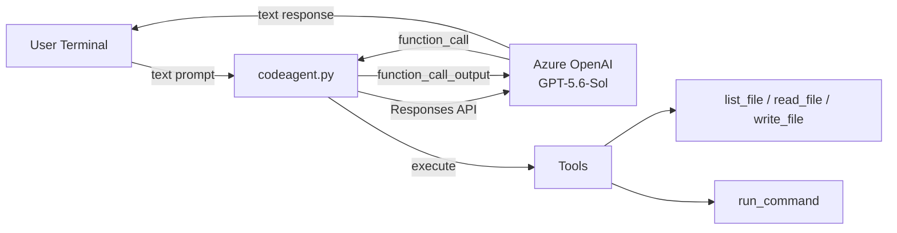
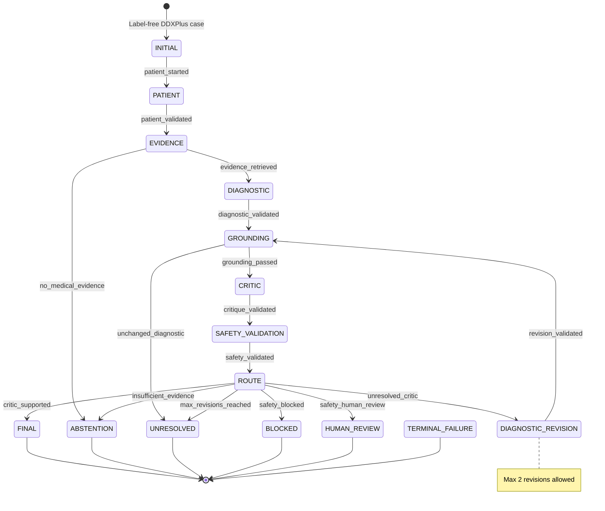
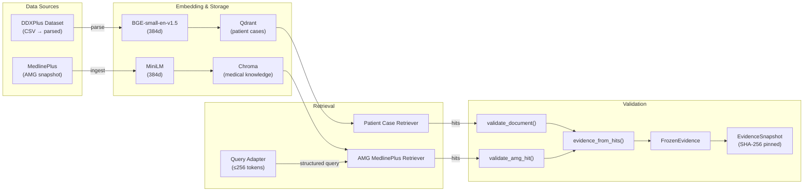
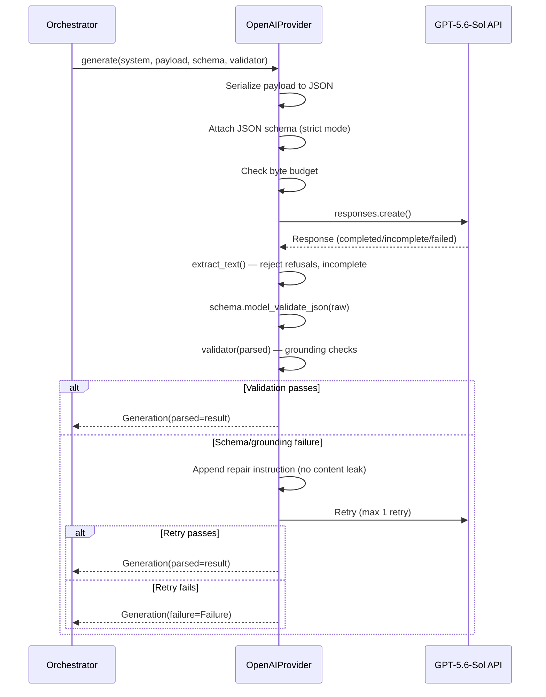
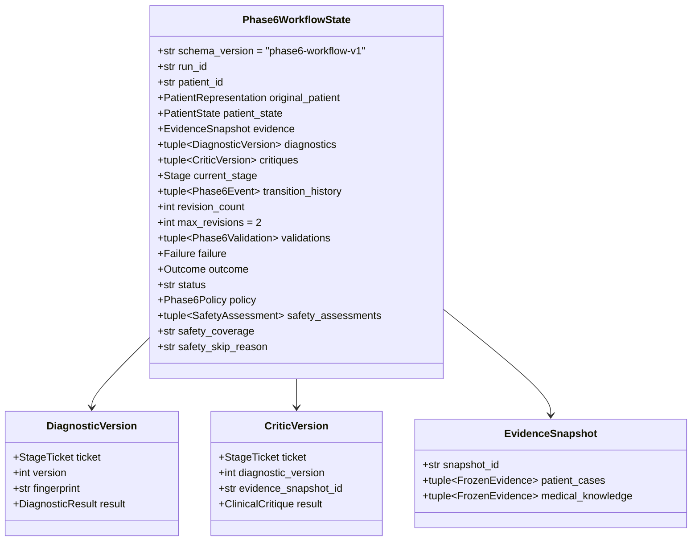
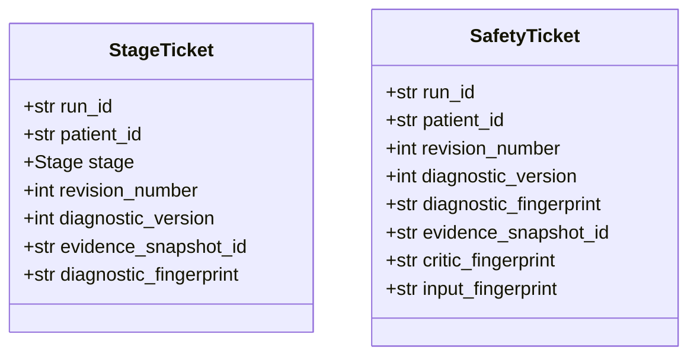
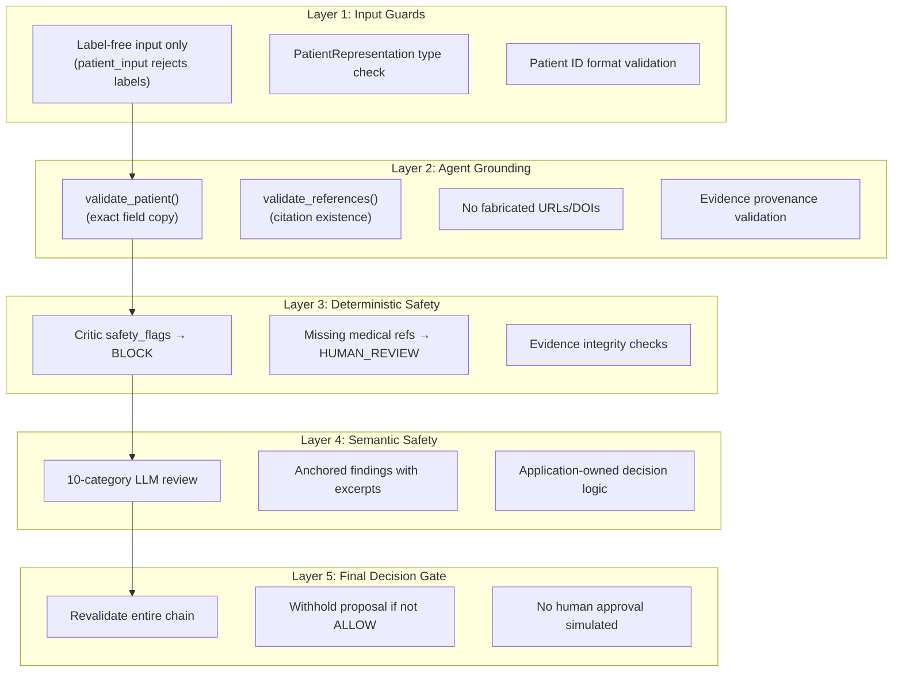
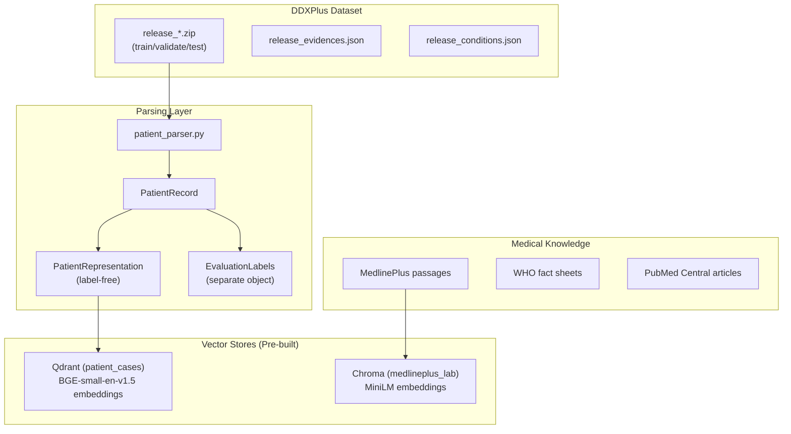

# Healthcare Agentic AI — Complete Architectural Analysis

> [!NOTE]
> This is a **research prototype** for synthetic DDXPlus cases — not a clinical diagnostic system. Every component explicitly disclaims clinical authority.

---

## 1. High-Level Project Composition

The workspace contains **two distinct systems** working in tandem:

| System | Root | Purpose |
|--------|------|---------|
| **Mini Claude Code** (codeagent) | [`codeagent.py`](file:///c:/Users/Hp/OneDrive/Desktop/HEALTHCARE%20AGENT/TEST%20AGENTS/mini-cc/codeagent.py) | A terminal-based AI coding agent for developing/iterating on the healthcare project |
| **Healthcare Agentic AI** | [`healthcare-agentic-ai/`](file:///c:/Users/Hp/OneDrive/Desktop/HEALTHCARE%20AGENT/TEST%20AGENTS/mini-cc/healthcare-agentic-ai) | The core clinical decision-support research system |

---

## 2. Mini Claude Code — The Outer Development Agent



### How It Works
- An **agentic loop** using the OpenAI Responses API with `previous_response_id` threading
- Four sandboxed tools: `list_file`, `read_file` (with optional line ranges), `write_file`, `run_command`
- Uses **OKF (Open Knowledge Format) v0.2** manifests ([`okf.yaml`](file:///c:/Users/Hp/OneDrive/Desktop/HEALTHCARE%20AGENT/TEST%20AGENTS/mini-cc/okf.yaml)) for token-efficient structural context
- System prompt enforces "check OKF first, use targeted line ranges, maintain OKF sync"
- Azure OpenAI endpoint with `GPT_SOL_API_KEY` credentials from `.env`

---

## 3. Healthcare Agentic AI — The Core System

### 3.1 Architectural Overview

```mermaid
graph TB
    subgraph "Application Layer"
        WF["application/workflow.py<br/>create_workflow()"]
        DEC["application/decision.py<br/>FinalDecision"]
        RES["application/resources.py<br/>CPU/memory preflight"]
    end

    subgraph "Orchestration Layer"
        subgraph "Phase 6 (Active)"
            P6O["phase6/orchestrator.py<br/>Phase6Orchestrator"]
            P6S["phase6/state.py<br/>Phase6WorkflowState"]
            P6R["phase6/routing.py<br/>route()"]
            P6G["phase6/grounding.py<br/>GroundingResult"]
            P6E["phase6/events.py<br/>Phase6Event"]
            P6C["phase6/contracts.py<br/>SafetyTicket"]
        end
        subgraph "Phase 5 (Baseline)"
            P5O["orchestrator.py<br/>Orchestrator"]
            P5S["state.py<br/>WorkflowState"]
            P5R["routing.py<br/>route()"]
        end
        EV["evidence.py<br/>EvidenceService / EvidenceSnapshot"]
        POL["policy.py<br/>WorkflowPolicy / WorkflowStop"]
        CON["contracts.py<br/>StageTicket / StageResponse"]
        EVT["events.py<br/>WorkflowEvent"]
    end

    subgraph "RAG Layer"
        subgraph "Clinical Agents"
            PA["PatientAgent"]
            DA["DiagnosticAgent"]
            CC["ClinicalCritic"]
        end
        subgraph "Evidence Retrieval"
            AMG["amg/service.py<br/>AMGEvidenceService"]
            QA["amg/query_adapter.py<br/>QueryRepresentation"]
            AB["amg/backend.py<br/>Retriever"]
            AP["amg/provenance.py<br/>validate_amg_hit"]
        end
        subgraph "Patient RAG"
            PR["patient_rag.py<br/>Patient Case RAG"]
            PI["patient_ingestion.py"]
            PP["patient_parser.py<br/>DDXPlus Parser"]
        end
        GR["agents/grounding.py<br/>validate_references"]
        PM["agents/prompts.py<br/>PATIENT/DIAGNOSTIC/CRITIC"]
        MD["agents/models.py<br/>PatientState/DiagnosticResult/ClinicalCritique"]
        LLM["llm/provider.py<br/>OpenAIProvider (GPT-5.6-Sol)"]
    end

    subgraph "Safety Layer"
        SV["validator.py<br/>SafetyValidator"]
        SP["policy.py<br/>make_assessment"]
        SM["models.py<br/>SafetyAssessment"]
        SVL["validation.py<br/>validate_semantic"]
        SPR["prompts.py<br/>SAFETY prompt"]
    end

    WF --> P6O
    WF --> AMG
    P6O --> PA & DA & CC & SV
    P6O --> EV
    P6O --> P6R
    P6R --> P5R
    P6O --> P6G
    PA & DA & CC --> LLM
    SV --> LLM
    AMG --> AB
    P6O --> SP
    DEC --> P6S
    DEC --> SP
```



### 3.2 Module Responsibility Matrix

| Module | Path | Responsibility |
|--------|------|---------------|
| **Application** | [`application/`](file:///c:/Users/Hp/OneDrive/Desktop/HEALTHCARE%20AGENT/TEST%20AGENTS/mini-cc/healthcare-agentic-ai/application) | Workflow composition, runtime preflight, final decision/review handoff |
| **Phase 6 Orchestration** | [`orchestration/phase6/`](file:///c:/Users/Hp/OneDrive/Desktop/HEALTHCARE%20AGENT/TEST%20AGENTS/mini-cc/healthcare-agentic-ai/orchestration/phase6) | Active versioned workflow with mandatory safety stage |
| **Phase 5 Orchestration** | [`orchestration/`](file:///c:/Users/Hp/OneDrive/Desktop/HEALTHCARE%20AGENT/TEST%20AGENTS/mini-cc/healthcare-agentic-ai/orchestration) | Baseline routing/gates reused by Phase 6 |
| **Clinical Agents** | [`rag/agents/`](file:///c:/Users/Hp/OneDrive/Desktop/HEALTHCARE%20AGENT/TEST%20AGENTS/mini-cc/healthcare-agentic-ai/rag/agents) | Patient/Diagnostic/Critic stateless LLM agents |
| **AMG Evidence** | [`rag/amg/`](file:///c:/Users/Hp/OneDrive/Desktop/HEALTHCARE%20AGENT/TEST%20AGENTS/mini-cc/healthcare-agentic-ai/rag/amg) | MedlinePlus medical knowledge retrieval |
| **Patient RAG** | [`rag/patient_*.py`](file:///c:/Users/Hp/OneDrive/Desktop/HEALTHCARE%20AGENT/TEST%20AGENTS/mini-cc/healthcare-agentic-ai/rag) | DDXPlus patient case vector similarity search |
| **LLM Provider** | [`rag/llm/provider.py`](file:///c:/Users/Hp/OneDrive/Desktop/HEALTHCARE%20AGENT/TEST%20AGENTS/mini-cc/healthcare-agentic-ai/rag/llm/provider.py) | Stateless GPT-5.6-Sol structured output adapter |
| **Safety** | [`safety/`](file:///c:/Users/Hp/OneDrive/Desktop/HEALTHCARE%20AGENT/TEST%20AGENTS/mini-cc/healthcare-agentic-ai/safety) | Deterministic + semantic output-safety validation |
| **Evaluation** | [`evaluation/`](file:///c:/Users/Hp/OneDrive/Desktop/HEALTHCARE%20AGENT/TEST%20AGENTS/mini-cc/healthcare-agentic-ai/evaluation) | Retrieval quality and relevance benchmarking |
| **Knowledge Base** | [`knowledge_base/`](file:///c:/Users/Hp/OneDrive/Desktop/HEALTHCARE%20AGENT/TEST%20AGENTS/mini-cc/healthcare-agentic-ai/knowledge_base) | Patient and medical data stores |

---

## 4. Complete Workflow — Stage-by-Stage Flow



### Stage Details

#### 4.1 INITIAL → PATIENT — Patient Agent
**File**: [`rag/agents/clinical.py → PatientAgent`](file:///c:/Users/Hp/OneDrive/Desktop/HEALTHCARE%20AGENT/TEST%20AGENTS/mini-cc/healthcare-agentic-ai/rag/agents/clinical.py#L10-L17)

- Receives a **label-free** `PatientRepresentation` (age, sex, symptoms, antecedents, initial_evidence)
- LLM structures it into a `PatientState` — a validated copy, NOT a diagnosis
- **Grounding gate**: `validate_patient()` ensures every field is an exact copy of the input; no hallucinated facts
- Prohibited: clinical interpretation, paraphrasing, diagnosis

#### 4.2 PATIENT → EVIDENCE — Evidence Retrieval
**File**: [`rag/amg/service.py → AMGEvidenceService`](file:///c:/Users/Hp/OneDrive/Desktop/HEALTHCARE%20AGENT/TEST%20AGENTS/mini-cc/healthcare-agentic-ai/rag/amg/service.py)

Two parallel retrieval paths, frozen into an **immutable `EvidenceSnapshot`**:

| Path | Embedding Model | Store | What It Retrieves |
|------|----------------|-------|-------------------|
| **Patient Cases** | BGE-small-en-v1.5 | Qdrant (local) | Analogous DDXPlus training cases (no labels!) |
| **Medical Knowledge** | MiniLM (AMG) | Chroma (MedlinePlus snapshot) | MedlinePlus clinical passages |

- The query adapter ([`amg/query_adapter.py`](file:///c:/Users/Hp/OneDrive/Desktop/HEALTHCARE%20AGENT/TEST%20AGENTS/mini-cc/healthcare-agentic-ai/rag/amg/query_adapter.py)) compresses patient facts into a ≤256-token role-structured query
- Evidence provenance is validated via `validate_amg_hit()` — every hit must trace to a known backend
- The snapshot is SHA-256 fingerprinted and frozen (immutable for the entire workflow)
- If no medical knowledge is retrieved → **ABSTENTION** (fail closed)

#### 4.3 EVIDENCE → DIAGNOSTIC — Diagnostic Agent
**File**: [`rag/agents/clinical.py → DiagnosticAgent`](file:///c:/Users/Hp/OneDrive/Desktop/HEALTHCARE%20AGENT/TEST%20AGENTS/mini-cc/healthcare-agentic-ai/rag/agents/clinical.py#L20-L35)

- Receives: `PatientState` + patient cases + medical knowledge
- Produces: `DiagnosticResult` with:
  - `primary_hypothesis` (nullable — can abstain)
  - `differential_diagnoses[]` — each with condition, rationale, supporting/contradicting evidence claims
  - Evidence inventories: `patient_case_evidence[]`, `medical_knowledge_evidence[]`
  - Explicit `uncertainty[]`, `missing_information[]`, `unsupported_claims[]`
- **Every claim must cite a supplied `source_id`** — no invented citations
- Retrieval similarity ≠ diagnostic confidence (enforced in prompt)

#### 4.4 DIAGNOSTIC → GROUNDING — Deterministic Grounding Gate
**File**: [`rag/agents/grounding.py → validate_references()`](file:///c:/Users/Hp/OneDrive/Desktop/HEALTHCARE%20AGENT/TEST%20AGENTS/mini-cc/healthcare-agentic-ai/rag/agents/grounding.py#L105-L135)

- **Hard deterministic gate** — no LLM involvement
- Validates: all `evidence_refs` exist in the supplied evidence set
- Validates: evidence category inventories exactly match claim references
- Validates: no fabricated URLs/DOIs appear in prose
- Validates: if no medical evidence exists, the agent must abstain
- Failure → `WorkflowStop('grounding_failure')`

#### 4.5 GROUNDING → CRITIC — Clinical Critic Agent
**File**: [`rag/agents/clinical.py → ClinicalCritic`](file:///c:/Users/Hp/OneDrive/Desktop/HEALTHCARE%20AGENT/TEST%20AGENTS/mini-cc/healthcare-agentic-ai/rag/agents/clinical.py#L38-L47)

- **Independent context** — no access to the diagnostic agent's reasoning
- Reviews the diagnostic output against the same evidence
- Produces `ClinicalCritique`:
  - `overall_assessment`: `supported_with_limitations` | `revision_required` | `insufficient_evidence`
  - `supported_points[]`, `unsupported_points[]`, `contradictions[]`
  - `hallucination_flags[]`, `safety_flags[]`
  - `recommended_revisions[]`
- Also goes through grounding validation

#### 4.6 CRITIC → SAFETY_VALIDATION — Output Safety (Phase 6 Only)
**Files**: [`safety/validator.py`](file:///c:/Users/Hp/OneDrive/Desktop/HEALTHCARE%20AGENT/TEST%20AGENTS/mini-cc/healthcare-agentic-ai/safety/validator.py), [`safety/policy.py`](file:///c:/Users/Hp/OneDrive/Desktop/HEALTHCARE%20AGENT/TEST%20AGENTS/mini-cc/healthcare-agentic-ai/safety/policy.py)

Two-layer safety assessment:

**Layer 1: Deterministic Checks** (no LLM)
- `critic_safety_flags` → if critic flagged safety concerns → **BLOCK**
- `hypothesis_medical_references` → if a hypothesis lacks medical refs → **HUMAN_REVIEW**
- Patient/evidence integrity, version identity

**Layer 2: Semantic Safety Review** (LLM-based, 10 mandatory categories)
| Category | If Identified |
|----------|---------------|
| `invented_patient_facts` | HUMAN_REVIEW |
| `unsupported_certainty` | HUMAN_REVIEW |
| `similarity_as_probability` | HUMAN_REVIEW |
| `analogy_as_outcome` | HUMAN_REVIEW |
| `source_misrepresentation` | HUMAN_REVIEW |
| `prohibited_action` | **BLOCK** |
| `unsafe_delay` | **BLOCK** |
| `diagnostic_critic_contradiction` | HUMAN_REVIEW |
| `instruction_following` | **BLOCK** |
| `safety_ambiguity` | HUMAN_REVIEW |

- Each finding is **anchored** to a specific field path (RFC 6901 JSON pointer) with an exact excerpt
- The LLM **cannot** author a safety decision — `make_assessment()` is deterministic application code
- `validate_assessment()` recomputes the policy at consumption time, rejecting forged assessments

#### 4.7 SAFETY → ROUTE — Deterministic Routing Decision
**File**: [`orchestration/phase6/routing.py → route()`](file:///c:/Users/Hp/OneDrive/Desktop/HEALTHCARE%20AGENT/TEST%20AGENTS/mini-cc/healthcare-agentic-ai/orchestration/phase6/routing.py)

```
IF critic_safety_flags OR safety BLOCK → BLOCKED
IF safety HUMAN_REVIEW → HUMAN_REVIEW
ELSE apply Phase 5 baseline routing:
    IF critic says insufficient_evidence → ABSTENTION
    IF needs_revision AND revisions < 2 → DIAGNOSTIC_REVISION
    IF needs_revision AND revisions ≥ 2 → UNRESOLVED
    IF diagnostic abstains → ABSTENTION
    ELSE → FINAL (accepted_with_limitations)
```

#### 4.8 Terminal → FinalDecision
**File**: [`application/decision.py → build_final_decision()`](file:///c:/Users/Hp/OneDrive/Desktop/HEALTHCARE%20AGENT/TEST%20AGENTS/mini-cc/healthcare-agentic-ai/application/decision.py#L66-L146)

- **No model calls** — pure deterministic projection
- Maps workflow status to release status:
  - `final` → `ALLOW` (research output only, never clinical clearance)
  - `blocked`/`failed` → `BLOCK`
  - Everything else → `HUMAN_REVIEW`
- **BLOCK/HUMAN_REVIEW withholds the diagnostic proposal** — the separate local audit retains it
- `human_approval` is hardcoded to `False`; `human_review_scheduled` is hardcoded to `False`
- Re-validates safety, grounding, and patient identity before emitting

---

## 5. Data Flow — Evidence Pipeline



### Key Design Decisions in Evidence Handling:
1. **Retrieve once, freeze forever** — evidence is immutable for the entire workflow
2. **Provenance validation** — every hit is validated against its backend schema before use
3. **Two separate embedding spaces** — BGE for patients, MiniLM for medical (different vector spaces, never mixed)
4. **Distance ≠ probability** — AMG scores are negative squared L2 distances, explicitly not diagnostic probabilities
5. **1.10 squared-L2 gate** — AMG rejects hits beyond this threshold

---

## 6. LLM Integration — Structured Output Protocol

**File**: [`rag/llm/provider.py → OpenAIProvider`](file:///c:/Users/Hp/OneDrive/Desktop/HEALTHCARE%20AGENT/TEST%20AGENTS/mini-cc/healthcare-agentic-ai/rag/llm/provider.py)



### Critical Design Constraints:
- **Stateless** — no conversation history, no tools, no shared context between agents
- **Strict JSON schema** via Responses API `text.format`
- **Max 1 structured-output retry** (2 total attempts)
- **Repair prompts never contain the rejected output, patient data, or exception messages** — only a generic "regenerate" instruction
- **Temperature fixed at 0** (though deployment may override)
- **SDK retries disabled** — an API failure is not a schema/medical failure
- **100KB input byte cap** per request

---

## 7. State Management — Immutable Versioned State

**Files**: [`orchestration/state.py`](file:///c:/Users/Hp/OneDrive/Desktop/HEALTHCARE%20AGENT/TEST%20AGENTS/mini-cc/healthcare-agentic-ai/orchestration/state.py), [`orchestration/phase6/state.py`](file:///c:/Users/Hp/OneDrive/Desktop/HEALTHCARE%20AGENT/TEST%20AGENTS/mini-cc/healthcare-agentic-ai/orchestration/phase6/state.py)



### State Design Principles:
- **Frozen** (`frozen=True`) — state is never mutated in place; `model_copy(update=...)` creates new instances
- **Versioned** — `schema_version: Literal['phase6-workflow-v1']` prevents cross-version state confusion
- **Phase 6 is NOT a subclass of Phase 5** — prevents `isinstance` bypass
- **Agents receive detached copies** — never the live state object
- **SHA-256 fingerprints** on diagnostics, evidence, and safety inputs for integrity verification
- **Strict Pydantic models** with `extra='forbid'` — no unrecognized fields

---

## 8. Budget & Policy System

**File**: [`orchestration/policy.py → WorkflowPolicy`](file:///c:/Users/Hp/OneDrive/Desktop/HEALTHCARE%20AGENT/TEST%20AGENTS/mini-cc/healthcare-agentic-ai/orchestration/policy.py)

| Limit | Default | Purpose |
|-------|---------|---------|
| `max_revisions` | 2 (hard-coded `Literal[2]`) | Maximum diagnostic revision cycles |
| `max_requests` | 21 | Total LLM API requests across entire workflow |
| `max_seconds` | 900s (15 min) | Wall-clock time budget |
| `max_request_bytes` | 7 MB | Total bytes sent to LLM |
| `provider_attempt_limit` | 3 | Max structured-output repair attempts |

Budget is checked:
- **Before every invocation** (with reserve for retries)
- **After every invocation**
- Violation → `WorkflowStop` → `TERMINAL_FAILURE`

---

## 9. Ticket System — Identity & Staleness Protection



- Every LLM invocation creates a ticket **before** the call
- The returned ticket is checked with `require_current()` — **exact match** or `WorkflowStop('stale_result')`
- Prevents: a delayed/replayed response from being accepted for a different workflow version
- The LLM **never** sees or authors tickets — they are application-owned

---

## 10. Safety Architecture — Defense in Depth



### Safety Invariants:
1. **LLM never authors routing decisions** — all routing is deterministic application code
2. **Rejected output never leaks into retry prompts** — repair instructions are generic
3. **Exception messages never persisted** — only safe error codes from allowlists
4. **ALLOW ≠ clinical clearance** — it means "eligible for research inspection only"
5. **Telemetry is sanitized** — only allowlisted numeric/boolean fields survive (`safe_observations()`)

---

## 11. Data Architecture



### Label Isolation:
- `PatientRepresentation` contains **only** age, sex, symptoms, antecedents, initial_evidence
- `EvaluationLabels` (ground_truth_pathology, differential_diagnosis) exists in a **separate object**
- Labels are **never loaded at runtime** — the system is designed to reject any labeled input
- `patient_input()` raises `TypeError` if passed a `PatientRecord` instead of `PatientRepresentation`

---

## 12. File Structure Map

```
mini-cc/
├── codeagent.py                          # Mini Claude Code terminal agent
├── .env                                  # Azure OpenAI credentials
├── okf.yaml                              # OKF structural context manifest
├── pyproject.toml                        # uv project config
├── context/base.md                       # Project context document
├── prompts/                              # Development agent prompt iterations
│   ├── MASTER.txt                        # Current master prompt (195KB!)
│   └── task*.txt, phase*.txt             # Historical iteration prompts
├── data/
│   ├── ddxplus/                          # DDXPlus patient dataset
│   └── medical_knowledge/                # Medical reference data
├── outputs/                              # Run artifacts
│
└── healthcare-agentic-ai/                # ===== CORE SYSTEM =====
    ├── application/
    │   ├── workflow.py                   # create_workflow() — single factory
    │   ├── decision.py                   # FinalDecision build
    │   └── resources.py                  # CPU/memory preflight
    ├── orchestration/
    │   ├── orchestrator.py               # Phase 5 Orchestrator (baseline)
    │   ├── state.py                      # Phase 5 WorkflowState
    │   ├── routing.py                    # Deterministic routing
    │   ├── contracts.py                  # StageTicket / StageResponse
    │   ├── events.py                     # Stage & EventName types
    │   ├── evidence.py                   # EvidenceService / EvidenceSnapshot
    │   ├── policy.py                     # WorkflowPolicy / budget limits
    │   └── phase6/
    │       ├── orchestrator.py           # Phase6Orchestrator (active)
    │       ├── state.py                  # Phase6WorkflowState
    │       ├── routing.py                # Safety-aware routing
    │       ├── contracts.py              # SafetyTicket
    │       ├── events.py                 # Phase6Event
    │       ├── grounding.py              # GroundingResult / ClaimGrounding
    │       ├── diagnostic.py             # Phase6 diagnostic/critic variants
    │       ├── reference_entailment.py   # Reference consistency audit
    │       └── policy.py                 # Phase6Policy
    ├── rag/
    │   ├── models.py                     # PatientRepresentation, EvaluationLabels
    │   ├── config.py                     # OpenAIConfig, PatientRAGConfig
    │   ├── phase4.py                     # Phase4Pipeline (legacy)
    │   ├── patient_parser.py             # DDXPlus CSV → PatientRecord
    │   ├── patient_ingestion.py          # validate_document()
    │   ├── patient_rag.py                # Patient case retrieval
    │   ├── patient_retriever.py          # Patient retriever interface
    │   ├── patient_audit.py              # Index audit tools
    │   ├── embeddings.py                 # Embedding model loading
    │   ├── vector_store.py               # Qdrant vector store
    │   ├── agents/
    │   │   ├── clinical.py               # PatientAgent / DiagnosticAgent / ClinicalCritic
    │   │   ├── models.py                 # PatientState / DiagnosticResult / ClinicalCritique
    │   │   ├── grounding.py              # validate_patient / validate_references
    │   │   ├── prompts.py                # PATIENT / DIAGNOSTIC / CRITIC prompts
    │   │   └── revision.py               # DiagnosticRevisionInput
    │   ├── llm/
    │   │   └── provider.py               # OpenAIProvider (GPT-5.6-Sol adapter)
    │   ├── amg/
    │   │   ├── service.py                # AMGEvidenceService
    │   │   ├── backend.py                # MedlinePlus Chroma retriever
    │   │   ├── query_adapter.py          # Patient → structured query
    │   │   ├── provenance.py             # validate_amg_hit()
    │   │   ├── alias_safety.py           # Medical alias handling
    │   │   └── baseline_compression.py   # Query compression
    │   ├── medical_ingestion/
    │   │   ├── models.py                 # Medical chunk validation
    │   │   ├── indexing.py               # Chroma indexing
    │   │   ├── medlineplus.py            # MedlinePlus ingestion
    │   │   ├── who.py                    # WHO data ingestion
    │   │   ├── pmc.py                    # PubMed Central ingestion
    │   │   ├── chunker.py                # Text chunking
    │   │   ├── corpus.py                 # Corpus management
    │   │   └── common.py                 # Shared ingestion utilities
    │   └── focused_medical.py            # FocusedEvidenceService
    ├── safety/
    │   ├── models.py                     # SafetyInput / SafetyAssessment / categories
    │   ├── policy.py                     # deterministic_findings / make_assessment
    │   ├── validation.py                 # validate_semantic / validate_anchor
    │   ├── validator.py                  # SafetyValidator (LLM wrapper)
    │   └── prompts.py                    # SAFETY review prompt
    ├── evaluation/
    │   └── reviewed_retrieval.py         # Retrieval quality benchmarking
    ├── scripts/
    │   ├── demo.py                       # Interactive demo entrypoint
    │   ├── run_phase6.py                 # Batch execution entrypoint
    │   ├── verify_amg_run.py             # Offline verification
    │   └── build_*.py, crawl_*.py        # Data preparation scripts
    ├── tests/                            # 52+ test files
    ├── vendor/amg/                       # Supplied AMG source & datasets
    ├── docs/                             # Architecture documentation
    └── archive/                          # Historical artifacts
```

---

## 13. Terminal Decision Outcomes

| Status | Trigger | Diagnostic Released? | Human Review? |
|--------|---------|---------------------|---------------|
| **ALLOW** | All gates pass, safety CONTINUE | ✅ (research only) | Not required |
| **HUMAN_REVIEW** | Safety review findings, insufficient evidence | ❌ Withheld | Pending (never scheduled) |
| **BLOCK** | Critic safety flags, semantic safety BLOCK | ❌ Withheld | Pending |
| **ABSTENTION** | No medical evidence, diagnostic abstains | ❌ N/A | Pending |
| **UNRESOLVED** | Max revisions, repeated diagnostic | ❌ Withheld | Pending |
| **TERMINAL_FAILURE** | Budget exhaustion, API failure, validation error | ❌ Withheld | Pending |

> [!IMPORTANT]
> **ALLOW never means clinical clearance.** It means the output passed all existing gates and is eligible for _research inspection only_. The disclaimer is hardcoded into every output.

---

## 14. Key Architectural Principles

1. **Fail Closed** — Any validation failure terminates the workflow; no fallback
2. **Label Isolation** — Ground-truth labels never enter the inference path
3. **LLM as Stateless Tool** — No conversation history, no tools, no memory
4. **Application-Owned Routing** — The LLM cannot influence its own routing decisions
5. **Evidence Immutability** — Retrieved once, frozen, fingerprinted, validated at every use
6. **Defensive Telemetry** — Only allowlisted scalars survive; no raw output in logs
7. **Version Boundaries** — Phase 5 and Phase 6 states are deliberately incompatible types
8. **Ticket-Based Staleness Protection** — Every invocation is identity-bound to exact versions
9. **No Human Approval Simulation** — The system explicitly does not simulate review workflows
10. **Deterministic Gates Over Statistical Checks** — Grounding uses exact reference matching, not NLI scores
