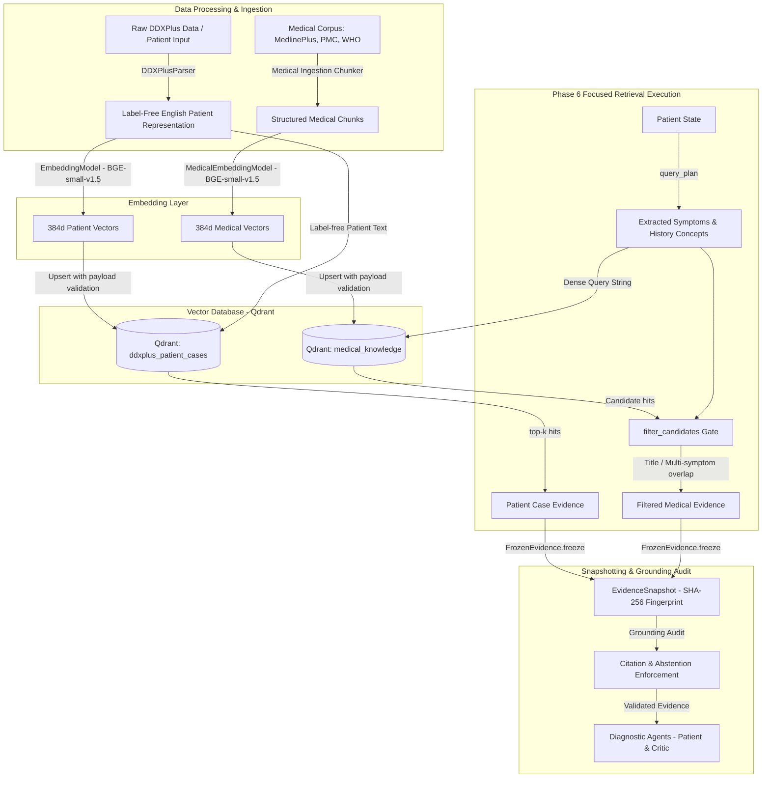

> **Task 7.3 status:** Sections 1-7 describe the existing production baseline, not
> a clinically validated system. The task-7.3 hybrid pipeline is a separate local
> experiment; see [implementation and results](task7.3-hybrid-retrieval.md).
> Benchmark labeling/auditing is paused and is not part of that experiment.
> Current patients are synthetic DDXPlus records. The indexed corpus contains
> 1,015 MedlinePlus summaries and two PMC articles; WHO is an adapter with zero
> indexed documents. Citation-ID validation does not establish entailment, and
> lexical overlap does not guarantee passage relevance.

# Comprehensive Technical Analysis of RAG Retrieval System in Healthcare Agentic AI

## 1. Executive Overview

The Retrieval-Augmented Generation (RAG) system in `healthcare-agentic-ai` is a **safety-critical, dual-store retrieval pipeline** designed specifically for clinical diagnostic reasoning and evidence grounding. Unlike generic RAG pipelines that query a single unstructured vector database with naive cosine similarity, this architecture implements:

1. **Dual Independent Vector Stores**: Complete separation between historical patient case databases (DDXPlus synthetic cases) and authoritative medical knowledge bases (MedlinePlus, PubMed Central, World Health Organization).
2. **Strict Label Isolation & Privacy**: Complete omission of dataset labels (`PATHOLOGY`, `DIFFERENTIAL_DIAGNOSIS`) during patient parsing, embedding, and retrieval to prevent label leakage.
3. **Local, CPU-First Embedding Enforcement**: Employs `BAAI/bge-small-en-v1.5` (384-dimensional dense embeddings) locally with context window truncation tracking and embedding signature manifests to prevent vector space contamination.
4. **Two-Stage Concept-Guided Retrieval (Phase 6 Focused Medical Retrieval)**: Combines dense vector similarity with deterministic medical concept extraction and title/symptom overlap filtering to reject irrelevant hits.
5. **Immutable Evidence Snapshots & Deterministic Grounding**: Cryptographically hashes evidence snapshots via SHA-256 and enforces strict citation audit gates before any LLM diagnostic agent output is accepted.

---

## 2. System Architecture & Workflow



---

## 3. Core Modules & Implementation Details

### 3.1 Vector Stores & Database Isolation
- **Patient Vector Store**: Implemented in [`rag/vector_store.py`](file:///c:/Users/Hp/OneDrive/Desktop/HEALTHCARE%20AGENT/TEST%20AGENTS/mini-cc/healthcare-agentic-ai/rag/vector_store.py) via `QdrantVectorStore`.
  - **Collection Name**: `ddxplus_patient_cases` (located at `data/qdrant/patient_cases`).
  - **Deterministic Point ID**: Generated via `uuid5(NAMESPACE_URL, 'ddxplus-patient/' + patient_id)`.
  - **Filter Enforcement**: Every search query strictly enforces `split == 'train'` filter (`models.MatchValue(value='train')`) to eliminate validation/test data leakage.
- **Medical Knowledge Vector Store**: Implemented in [`rag/medical_vector_store.py`](file:///c:/Users/Hp/OneDrive/Desktop/HEALTHCARE%20AGENT/TEST%20AGENTS/mini-cc/healthcare-agentic-ai/rag/medical_vector_store.py) via `MedicalVectorStore`.
  - **Collection Name**: `medical_knowledge` (located at `data/qdrant`).
  - **Source Validation**: Queries filter against trusted medical sources (`medlineplus`, `pmc`, `who`).
  - **Strict Collection Guard**: Instantiation raises `ValueError` if any non-medical collection name is specified, ensuring patient and medical collections are physically isolated.
- **Signature Manifests**: Both vector stores maintain JSON signature files (`embedding-<hash>.json` and `medical-embedding.json`). If the embedding model, dimension, or text normalization settings change, collection access fails immediately to prevent mixing incompatible vector spaces.

### 3.2 Embedding Engine
Implemented in [`rag/embeddings.py`](file:///c:/Users/Hp/OneDrive/Desktop/HEALTHCARE%20AGENT/TEST%20AGENTS/mini-cc/healthcare-agentic-ai/rag/embeddings.py) and [`rag/medical_embeddings.py`](file:///c:/Users/Hp/OneDrive/Desktop/HEALTHCARE%20AGENT/TEST%20AGENTS/mini-cc/healthcare-agentic-ai/rag/medical_embeddings.py).

- **Embedding Model**: `BAAI/bge-small-en-v1.5` loaded locally via `sentence_transformers.SentenceTransformer`.
- **Vector Parameters**: 384 dimensions, Cosine distance, `normalize_embeddings=True`.
- **Context Window & Truncation Accounting**:
  - The embedder inspects token length prior to encoding using the underlying tokenizer.
  - If input texts exceed the model's `max_seq_length` (512 tokens), it increments `truncated_texts` and emits warnings while keeping payload text intact.

### 3.3 Patient Case Ingestion & Parsing
Implemented in [`rag/patient_parser.py`](file:///c:/Users/Hp/OneDrive/Desktop/HEALTHCARE%20AGENT/TEST%20AGENTS/mini-cc/healthcare-agentic-ai/rag/patient_parser.py).

- **DDXPlus Decoding**: Translates encoded clinical findings (e.g. `E_58`, `V_12`) into natural language clinical evidence objects using `release_evidences.json` and `release_conditions.json`.
- **Label Isolation Protocol**: Functions like `parse_patient()` strictly process clinical evidence columns (`AGE`, `SEX`, `EVIDENCES`, `INITIAL_EVIDENCE`) and never touch target diagnosis columns (`PATHOLOGY`, `DIFFERENTIAL_DIAGNOSIS`).
- **Textual Serialization (`to_text()`)**: Generates normalized English summaries such as:
  ```text
  Patient: Age: 10 Sex: Female Symptoms / clinical evidence:
  - Do you feel anxious? = Yes
  - Have you had significantly increased sweating? = Yes
  - Characterize your pain: = a cramp
  - Do you feel pain somewhere? = side of the chest(R)
  ```

### 3.4 Medical Knowledge Ingestion & Chunking
Implemented in [`rag/medical_ingestion/`](file:///c:/Users/Hp/OneDrive/Desktop/HEALTHCARE%20AGENT/TEST%20AGENTS/mini-cc/healthcare-agentic-ai/rag/medical_ingestion/).

- **Corpus Sources**:
  1. **MedlinePlus**: Parsed HTML documents from NIH MedlinePlus health topics.
  2. **PMC**: Selected open-access PubMed Central clinical literature.
  3. **WHO**: Official World Health Organization guidelines.
- **Section-Aware Chunking (`chunker.py`)**:
  - For MedlinePlus: Uses `sections-v2` strategy to split documents by section headers, ensuring semantic coherence. Small sections under 40 words are merged into adjacent sections.
  - For PMC/WHO: Uses a word sliding window algorithm (default max words: 180, overlap: 30 words).
- **Corpus Deduplication & Fingerprinting (`indexing.py`)**: Exact global text deduplication is performed during indexing, and a deterministic SHA-256 fingerprint is recorded in `medical-index.json`.

---

## 4. Two-Stage Focused Medical Retrieval (Phase 6)

Standard vector retrieval often fetches articles based on generic terminology rather than specific clinical findings. To address this, [`rag/focused_medical.py`](file:///c:/Users/Hp/OneDrive/Desktop/HEALTHCARE%20AGENT/TEST%20AGENTS/mini-cc/healthcare-agentic-ai/rag/focused_medical.py) implements the `FocusedEvidenceService`.

### Step 1: Deterministic Concept Extraction (`query_plan`)
The patient state is parsed to extract key clinical concepts using a curated dictionary of medical aliases (`ALIASES`):

```python
ALIASES = {
    'shortness of breath': ('shortness of breath', 'difficulty breathing', 'dyspnea', 'breathlessness'),
    'palpitations': ('palpitations', 'heart racing', 'racing heart'),
    'sweating': ('sweating', 'diaphoresis'),
    'chest pain': ('chest pain', 'chest tightness', 'side of the chest'),
    ...
}
```

- **Symptom Concepts**: Up to 12 extracted symptom concepts (e.g., `chest pain`, `sweating`, `shortness of breath`).
- **History Concepts**: Up to 4 antecedent history concepts (e.g., `asthma`, `head trauma`).
- **Demographic Categorization**: Age is bucketed into `pediatric` (<18), `adult` (18-64), or `older adult` (>=65).
- **Dense Query Construction**: Formats a targeted search query string combining demographics, symptoms, antecedents, and red-flag terms.

### Step 2: Vector Candidate Search
The constructed query is sent to `MedicalKnowledgeRetriever.retrieve()` to fetch top candidate hits (default candidate `top_k = 5`).

### Step 3: Lexical Concept Filter (`filter_candidates`)
Instead of applying an arbitrary cosine similarity score threshold, candidate hits undergo concept overlap evaluation:

1. **Topic Title Overlap**: Retained if candidate chunk `title` matches any extracted symptom or history concept.
2. **Multi-Symptom Overlap**: Retained if candidate chunk `text` matches **2 or more** extracted symptom concepts.
3. **Rejection**: Hits failing both criteria are rejected with reason `insufficient_concept_overlap`.

An audit log (`audit`) records decision details for every candidate chunk, including matches, retention status, and reasons.

---

## 5. Immutable Evidence Snapshots & Multi-Agent Safety Grounding

### 5.1 Evidence Snapshots & Fingerprinting
Implemented in [`orchestration/evidence.py`](file:///c:/Users/Hp/OneDrive/Desktop/HEALTHCARE%20AGENT/TEST%20AGENTS/mini-cc/healthcare-agentic-ai/orchestration/evidence.py).

- **Frozen Evidence Model (`FrozenEvidence`)**: Converts retrieved search hits into immutable Pydantic models with explicit `source_type` (`patient_case` or `medical_knowledge`), `source_id` (e.g. `case:ddxplus:train:514` or `medical:medlineplus:m001`), `similarity`, `title`, `text`, and JSON metadata.
- **SHA-256 Snapshot ID**: Hashing the content dictionary generates `snapshot_id`.
- **Integrity Validation**: The `EvidenceSnapshot.check_integrity()` method reconstitutes thawed evidence objects and verifies that metadata, similarity scores, and source IDs have not been modified.

### 5.2 Citation Enforcement & Abstention Gates
Implemented in [`rag/agents/grounding.py`](file:///c:/Users/Hp/OneDrive/Desktop/HEALTHCARE%20AGENT/TEST%20AGENTS/mini-cc/healthcare-agentic-ai/rag/agents/grounding.py).

- **Fact Mapping**: Assigns deterministic IDs to patient inputs (e.g. `patient:age`, `patient:sex`, `patient:symptoms:0`).
- **Citation Verification (`validate_references`)**:
  - Every rationale and claim generated by diagnostic LLMs must explicitly cite valid evidence IDs (`patient:*`, `case:*`, or `medical:*`).
  - Uncited claims or invented references trigger a `ValueError('Unknown evidence reference')`.
- **Mandatory Abstention Gate**: If no relevant medical knowledge is retrieved for a case (and explicit patient-only inference contracts are inactive), diagnostic models are **required to abstain** rather than hallucinating diagnoses.

---

## 6. Directory & Code Reference Map

| Component / Functionality | File Path | Key Classes & Functions |
| :--- | :--- | :--- |
| **RAG Configuration** | [`rag/config.py`](file:///c:/Users/Hp/OneDrive/Desktop/HEALTHCARE%20AGENT/TEST%20AGENTS/mini-cc/healthcare-agentic-ai/rag/config.py) | `PatientRAGConfig`, `resolve_data_dir()` |
| **Embeddings Engine** | [`rag/embeddings.py`](file:///c:/Users/Hp/OneDrive/Desktop/HEALTHCARE%20AGENT/TEST%20AGENTS/mini-cc/healthcare-agentic-ai/rag/embeddings.py) | `EmbeddingModel`, `embed_texts()`, `embed_text()` |
| **Medical Embeddings** | [`rag/medical_embeddings.py`](file:///c:/Users/Hp/OneDrive/Desktop/HEALTHCARE%20AGENT/TEST%20AGENTS/mini-cc/healthcare-agentic-ai/rag/medical_embeddings.py) | `MedicalEmbeddingModel` |
| **Patient Vector Store** | [`rag/vector_store.py`](file:///c:/Users/Hp/OneDrive/Desktop/HEALTHCARE%20AGENT/TEST%20AGENTS/mini-cc/healthcare-agentic-ai/rag/vector_store.py) | `QdrantVectorStore`, `upsert_patients()`, `search()` |
| **Medical Vector Store** | [`rag/medical_vector_store.py`](file:///c:/Users/Hp/OneDrive/Desktop/HEALTHCARE%20AGENT/TEST%20AGENTS/mini-cc/healthcare-agentic-ai/rag/medical_vector_store.py) | `MedicalVectorStore`, `upsert_chunks()`, `search()` |
| **Patient Case Retriever** | [`rag/patient_retriever.py`](file:///c:/Users/Hp/OneDrive/Desktop/HEALTHCARE%20AGENT/TEST%20AGENTS/mini-cc/healthcare-agentic-ai/rag/patient_retriever.py) | `PatientCaseRetriever`, `retrieve()` |
| **Medical Retriever** | [`rag/medical_retriever.py`](file:///c:/Users/Hp/OneDrive/Desktop/HEALTHCARE%20AGENT/TEST%20AGENTS/mini-cc/healthcare-agentic-ai/rag/medical_retriever.py) | `MedicalKnowledgeRetriever`, `retrieve()` |
| **Focused Medical RAG** | [`rag/focused_medical.py`](file:///c:/Users/Hp/OneDrive/Desktop/HEALTHCARE%20AGENT/TEST%20AGENTS/mini-cc/healthcare-agentic-ai/rag/focused_medical.py) | `FocusedEvidenceService`, `query_plan()`, `filter_candidates()` |
| **Patient Parser & Decoder** | [`rag/patient_parser.py`](file:///c:/Users/Hp/OneDrive/Desktop/HEALTHCARE%20AGENT/TEST%20AGENTS/mini-cc/healthcare-agentic-ai/rag/patient_parser.py) | `DDXPlusParser`, `parse_patient()`, `decode_evidence()` |
| **Medical Chunking & Indexing** | [`rag/medical_ingestion/indexing.py`](file:///c:/Users/Hp/OneDrive/Desktop/HEALTHCARE%20AGENT/TEST%20AGENTS/mini-cc/healthcare-agentic-ai/rag/medical_ingestion/indexing.py) | `build_index()`, `audit_index()` |
| **Evidence Snapshotting** | [`orchestration/evidence.py`](file:///c:/Users/Hp/OneDrive/Desktop/HEALTHCARE%20AGENT/TEST%20AGENTS/mini-cc/healthcare-agentic-ai/orchestration/evidence.py) | `EvidenceSnapshot`, `FrozenEvidence`, `EvidenceService` |
| **Grounding & Citation Safety** | [`rag/agents/grounding.py`](file:///c:/Users/Hp/OneDrive/Desktop/HEALTHCARE%20AGENT/TEST%20AGENTS/mini-cc/healthcare-agentic-ai/rag/agents/grounding.py) | `validate_references()`, `evidence_from_hits()`, `context()` |

---

## 7. Summary of Key Strengths

- **Zero Data Leakage**: Enforces non-overlapping Qdrant collections and strict training split filters (`split == 'train'`).
- **Citation-ID Validation**: Rejects unknown document/fact references; it does not guarantee that cited text entails a claim.
- **Local & Deterministic**: Runs local `BAAI/bge-small-en-v1.5` embeddings without cloud latency or third-party embedding drift.
- **Heuristic Filtering**: Concept overlap limits the baseline evidence pool, but can admit weak title-only matches and reject useful passages. It does not guarantee relevance.
